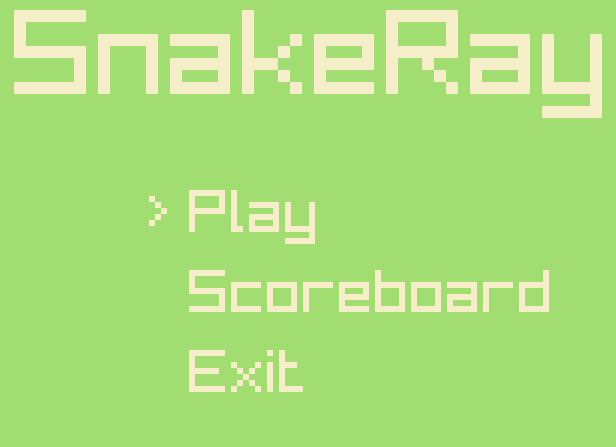
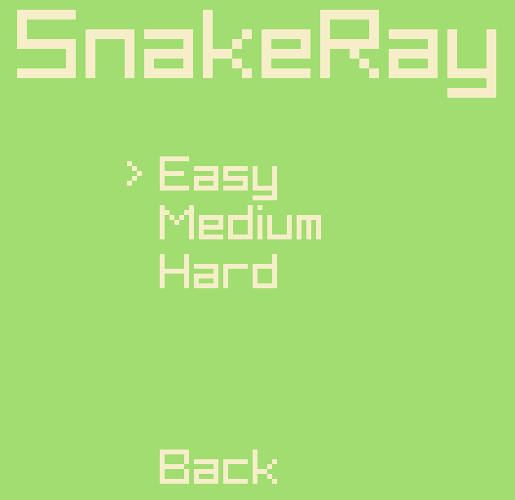
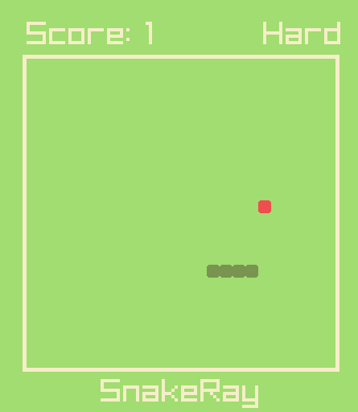
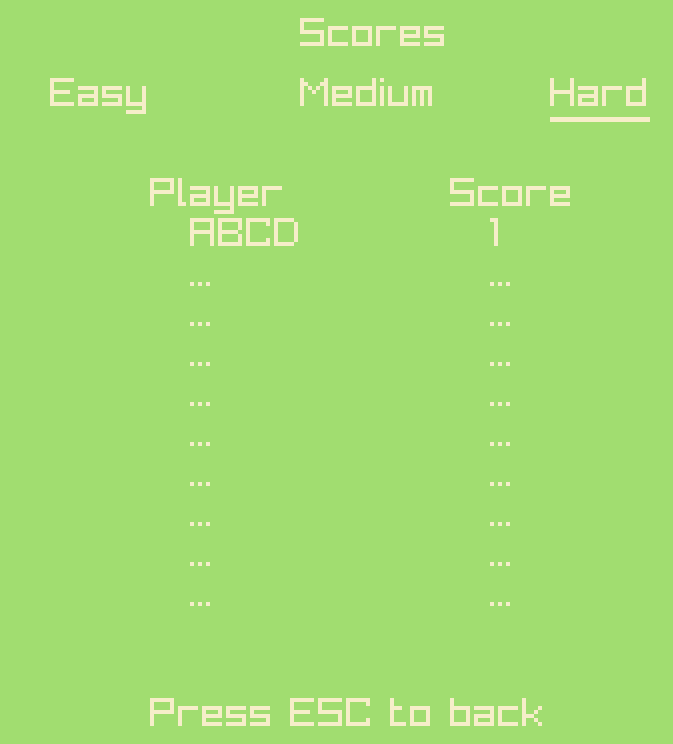
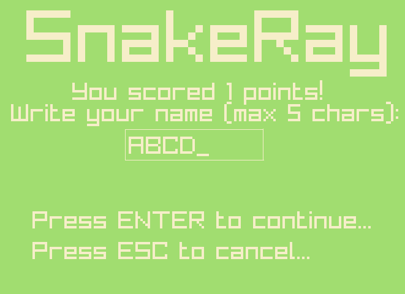

# 🐍 SnakeRay (Snake Game | C++ & raylib)
An educational implementation of the classic Snake game, developed in C++ using the raylib library. This project was created for learning purposes focusing on C++ programming and game architecture.


# Features
+ **Main menu:** AN intuitive main menu allowing players to start the game and view scoreboard.  

+ **Difficulty levels:** Three difficulty levels - Easy, Medium, and Hard - affecting the size of the game board.  

+ **Gameplay:** Classic Snake mechanics.   

+ **Scoreboard:** Separate scoreboards for each difficulty level, storing up to 10 top scores.   

+ **Score saving:** After the game ends, if the player's score qualifies, they can enter their name (up to 5 characters) to be recorded on the scoreboard.   


# Technologies
+ C++ 
+ raylib
+ Premake5
+ Custom game engine with scene management support.

# How to get it
1. Clone repository:  
``` bash
git clone https://github.com/TheSparrowsky/SnakeRay.git
```
2. Initialize and update submodules:
``` bash
git submodule update --init
```
3. Run `build.bat` to generate a Visual Studio 2022 solution, or use Premake according to your preferences.

# Controls
+ **WSAD / Arrows keys:** Navigate the snake or menu
+ **ENTER:** Confirm selection
+ **ESC:** return to the previous menu or main menu during gameplay 

# Educational objectives
1. Learn C++ programming
2. Understand game structure and architecture
3. Apply the raylib library in creating 2D games

# Acknowledgments
+ [Raylib Team](https://www.raylib.com/): For the fantastic, easy-to-use game library 
+ [Premake5](https://premake.github.io/)
+ [Pelatho](https://thowsenmedia.itch.io/ui-sounds) - for excellent sfx
+ [HUNTER AUDIO PRODUCTION](https://hunteraudio.itch.io/8bit-sfx-and-music-pack) - for great music and sfx